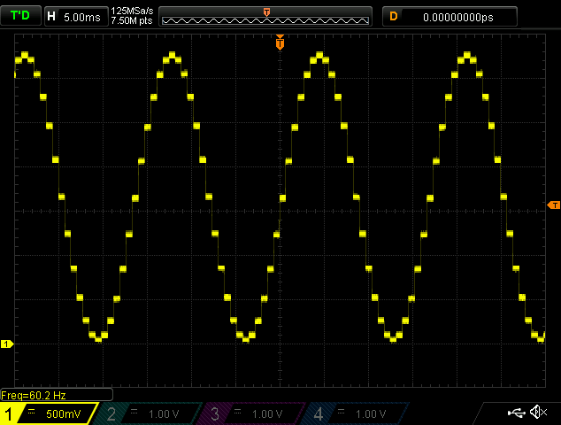
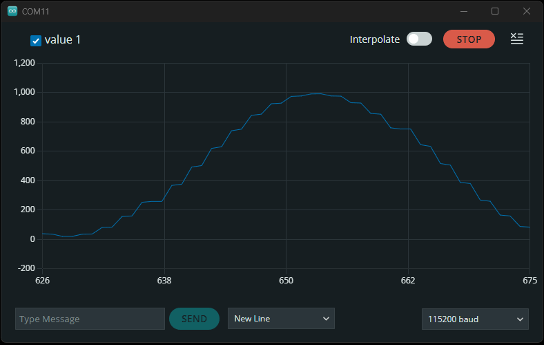
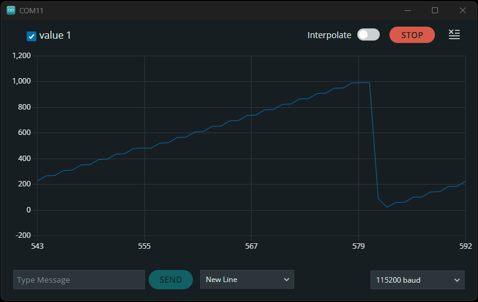

## Analog Input
The RA6M5 Thing Plus includes several breakout pins with access to the 12-bit ADC channels of the RA6M5. These feature is primarily used to record analog data from potentiometers and various sensors. For this example, users are free to utilize any hardware they have to connect the ADC from the `A0` GPIO pins to an analog signal. We recommend selecting a device with a product manual that provides electrical diagrams and example code; below, are a few examples:


??? note "Optional Hardware"
	<div class="grid cards" markdown>

	-   <a href="https://www.sparkfun.com/products/12758">
		<figure markdown>
		
		</figure>

		---

		**SparkFun Electret Microphone Breakout**<br>
		BOB-12758</a>


	-   <a href="https://www.sparkfun.com/products/9088">
		<figure markdown>
		
		</figure>

		---

		**Mini Photocell**<br>
		SEN-09088</a>


	-   <a href="https://www.sparkfun.com/products/9806">
		<figure markdown>
		
		</figure>

		---

		**Trimpot 10K Ohm with Knob**<br>
		COM-09806</a>


	-   <a href="https://www.sparkfun.com/products/9194">
		<figure markdown>
		
		</figure>

		---

		**Jumper Wires Premium 6" Mixed Pack of 100**<br>
		PRT-09194</a>


	-   <a href="https://www.sparkfun.com/products/501">
		<figure markdown>
		
		</figure>

		---

		**IC Hook Test Leads**<br>
		CAB-00501</a>

	</div>


Below, are some basic example sketches for capturing analog data from generic devices such as a potentiometer or photocell.


=== "`AnalogReadSerial.ino`"
	Users can find this sketch in the **File** > **Examples** > **01.basics** > **AnalogReadSerial** drop-down menu.

	??? code "`InputPullupSerial.ino`"
		--8<-- "https://raw.githubusercontent.com/arduino/docs-content/main/content/built-in-examples/01.basics/AnalogReadSerial/AnalogReadSerial.md:57:57"


=== "`ReadAnalogVoltage.ino`"
	Users can find this sketch in the **File** > **Examples** > **01.basics** > **ReadAnalogVoltage** drop-down menu.

	??? code "`Debounce.ino`"
		--8<-- "https://raw.githubusercontent.com/arduino/docs-content/main/content/built-in-examples/01.basics/ReadAnalogVoltage/ReadAnalogVoltage.md:57:57"


## Analog Output


### AnalogWave Library
To implement the [`#!cpp AnalogWave` library from the Renesas Arduino core](https://github.com/arduino/ArduinoCore-renesas/tree/main/libraries/AnalogWave), users will need to link the library at the beginning of their sketch.


```c++
#include "analogWave.h" // Include the library for analog waveform generation
```


Once linked, users will need to create an instance of the `#!cpp analogWave` class and declare a DAC `pin` for the output.


```c++
analogWave wave(pin);   // Create an instance of the analogWave class, using a DAC pin
```


!!! tip
	In the Renesas-Arduino core, `DAC` and `DAC1` are predefined variables for their corresponding GPIO pins on the RA6M5 Thing Plus.

	!!! code
		```c++
		analogWave waveA0(DAC);    // Create an instance of the analogWave class, using the DAC pin (A0)
		analogWave waveA1(DAC1);   // Create an instance of the analogWave class, using the DAC1 pin (A1)
		```


Below, are a few of the key methods available for the `analogWave` class:


??? code "Methods in `analogWave.h`"
	```cpp
	--8<-- "https://raw.githubusercontent.com/arduino/ArduinoCore-renesas/main/libraries/AnalogWave/analogWave.h:42:54"


	--8<-- "https://raw.githubusercontent.com/arduino/ArduinoCore-renesas/main/libraries/AnalogWave/analogWave.h:62:64"
	```


	*For more information, please refer to the [`analogWave.cpp`](https://github.com/arduino/ArduinoCore-renesas/blob/main/libraries/AnalogWave/analogWave.cpp) file in the `AnalogWave` library.*


When generating an output signal from the DAC of the RA6M5 Thing Plus, users will need to define the waveform's type and frequency:


```cpp
int freq = 20;       // waveform frequency in Hz
```

```cpp
wave.sine(freq);      // Generates a sine wave with a 20Hz frequency
```


### Oscilloscope
Oscilloscopes are the perfect tool to capture the waveform of a signal output. While useful, not all users will have access to this type of test equipment. For this example, user will need connect the probe from an oscilloscope to the `DAC` (`A0`) and `GND` GPIO pins.


<div class="grid" markdown>

<div markdown>

!!! code "Sine Wave"
	```cpp
	#include "analogWave.h" // Include the library for analog waveform generation

	analogWave wave(DAC);   // Create an instance of the analogWave class, using the DAC pin

	int freq = 60;  // in hertz, change accordingly

	void setup() {
	  wave.sine(freq);       // Generate a sine wave with the initial frequency
	}

	void loop() {}
	```

</div>


<div markdown>

<figure markdown>
[{ width=400 }](./assets/img/hookup_guide/example-DAC_oscilloscope.png "Click to enlarge")
<figcaption markdown>A screen capture of a sine wave output from the `DAC` GPIO, which recorded on an oscilloscope.</figcaption>
</figure>

</div>

</div>


??? tip "Oscilloscope Adjustments"
	The DAC of the RA6M5, generates a waveform with a positive voltage. Therefore, user may need to adjust the vertical position of the probe's input channel.

	Users may also find it helpful, to set the trigger on a discretized voltage step.


### Feedback Loop
Another method to record the signal generated by the DAC, is with a jumper *(wire)* and looping a output signal from the `DAC1` GPIO pin back into the `A2` GPIO pin. While an oscilloscope is very useful, this is a more practical and cost-effective alternative for users. With this example, users are free to utilize any method or hardware they have to connect the `DAC1` and `A2` GPIO pins together. However, we recommend some IC hooks for a temporary connection.


??? note "Optional Hardware"
	<div class="grid cards" markdown>

	-   <a href="https://www.sparkfun.com/products/501">
		<figure markdown>
		
		</figure>

		---

		**IC Hook Test Leads**<br>
		CAB-00501</a>


	-   <a href="https://www.sparkfun.com/products/9741">
		<figure markdown>
		
		</figure>

		---

		**IC Hook with Pigtail**<br>
		CAB-09741</a>


	-   <a href="https://www.sparkfun.com/products/9194">
		<figure markdown>
		
		</figure>

		---

		**Jumper Wires Premium 6" Mixed Pack of 100**<br>
		PRT-09194</a>


	-   <a href="https://www.sparkfun.com/products/116">
		<figure markdown>
		
		</figure>

		---

		**Break Away Headers - Straight**<br>
		PRT-00116</a>


	-   <a href="https://www.sparkfun.com/products/9044">
		<figure markdown>
		
		</figure>

		---

		**Jumper - 2 Pin**<br>
		PRT-09044</a>

	</div>


After users have jumpered the GPIO pins and uploaded the example code, they will need to open the [**Serial Plotter**](https://docs.arduino.cc/software/ide-v2/tutorials/ide-v2-serial-plotter/) in the Arduino IDE. Once opened, the tool will begin to plot the values that are received from the serial port. It should be noted that the **Serial Plotter** tool is unavailable in the *legacy* Arduino IDE v1.`x`.`x`; and some users may need to upgrade to the new [Arduino IDE v2.`x`.`x`](https://docs.arduino.cc/software/ide-v2/tutorials/getting-started-ide-v2/) to access this tool. Additionally, the speed and buffer of the **Serial Plotter** tool are limiting factors in its performance. Therefore, careful consideration should be made when adjusting the waveform frequency and the delay intervals between readings.


<div class="grid" markdown>

<div markdown>

!!! code "Sine Wave"
	```cpp
	#include "analogWave.h" // Include the library for analog waveform generation

	analogWave wave(DAC1);   // Create an instance of the analogWave class, using the DAC pin

	int freq = 1;  // in hertz, change accordingly

	void setup() {
	  Serial.begin(115200);  // Initialize serial communication at a baud rate of 115200
	  wave.sine(freq);       // Generate a sine wave with the initial frequency
	}

	void loop() {
	  // Print the updated frequency to the serial monitor
	  Serial.println(String(analogRead(A2)));
	  delay(20);      // Delay for 20ms before repeating
	}
	```

</div>


<div markdown>

!!! Serial "Serial Plot"
	<figure markdown>
	[{ width=400 }](./assets/img/hookup_guide/example-analog_sine.gif "Click to enlarge")
	<figcaption markdown>**Serial Plot** of a sine wave output from the `DAC` GPIO, which was read by the `A2` GPIO.</figcaption>
	</figure>

</div>

</div>


??? abstrat "Other Waveforms"
	Users can modify this example to generate other types of waveforms, as shown in the examples below.


	<div class="grid" markdown>

	<div markdown>

	<figure markdown>
	[{ width=400 }](./assets/img/hookup_guide/example-analog_square.gif "Click to enlarge")
	<figcaption markdown>**Serial Plot** of a square wave generated by the `DAC` GPIO, which was recorded by the `A2` GPIO.</figcaption>
	</figure>


	!!! code "Square Wave"
		Users can modify the type of waveform output by the DAC. The modification below will generate a square waveform:

			{--wave.sine(freq);--}
			{++wave.square(freq);++}

	</div>


	<div markdown>

	<figure markdown>
	[{ width=400 }](./assets/img/hookup_guide/example-analog_saw.gif "Click to enlarge")
	<figcaption markdown>**Serial Plot** of a sawtooth wave generated by the `DAC` GPIO, which was recorded by the `A2` GPIO.</figcaption>
	</figure>


	!!! code "Sawtooth Wave"
		Users can modify the type of waveform output by the DAC. The modification below will generate a sawtooth waveform:

			{--wave.sine(freq);--}
			{++wave.saw(freq);++}

	</div>

	</div>
