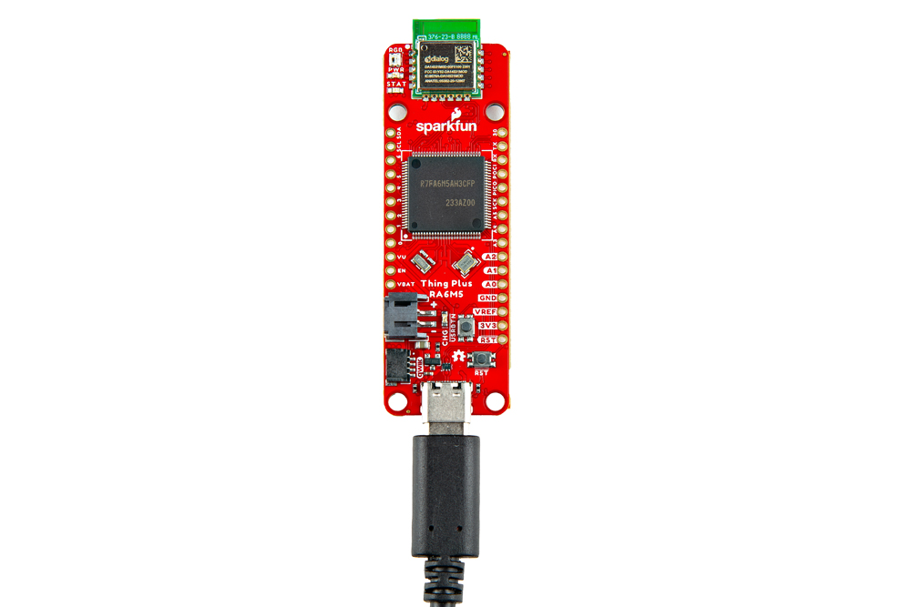
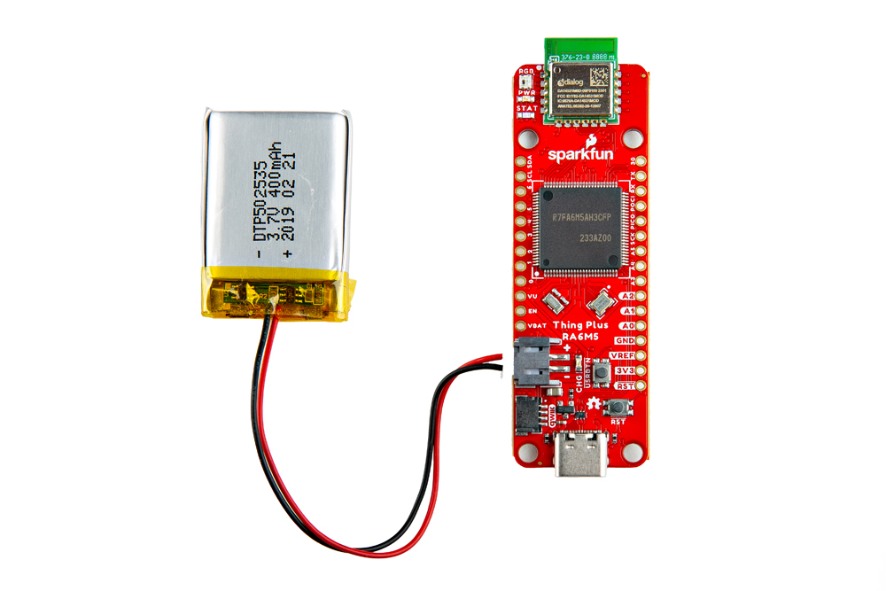
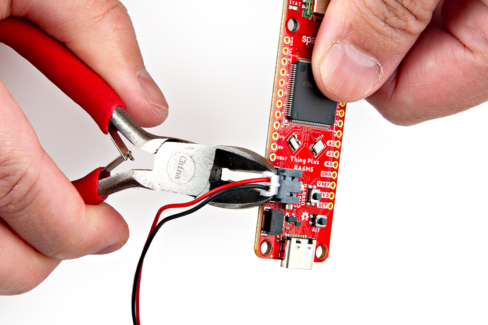
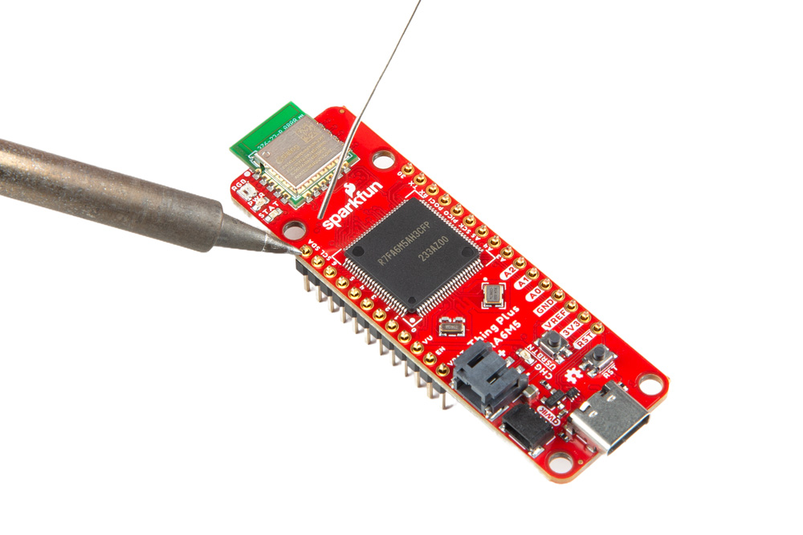
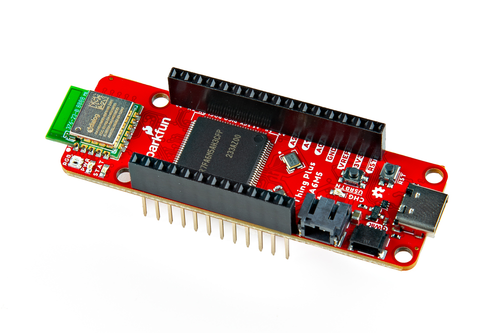
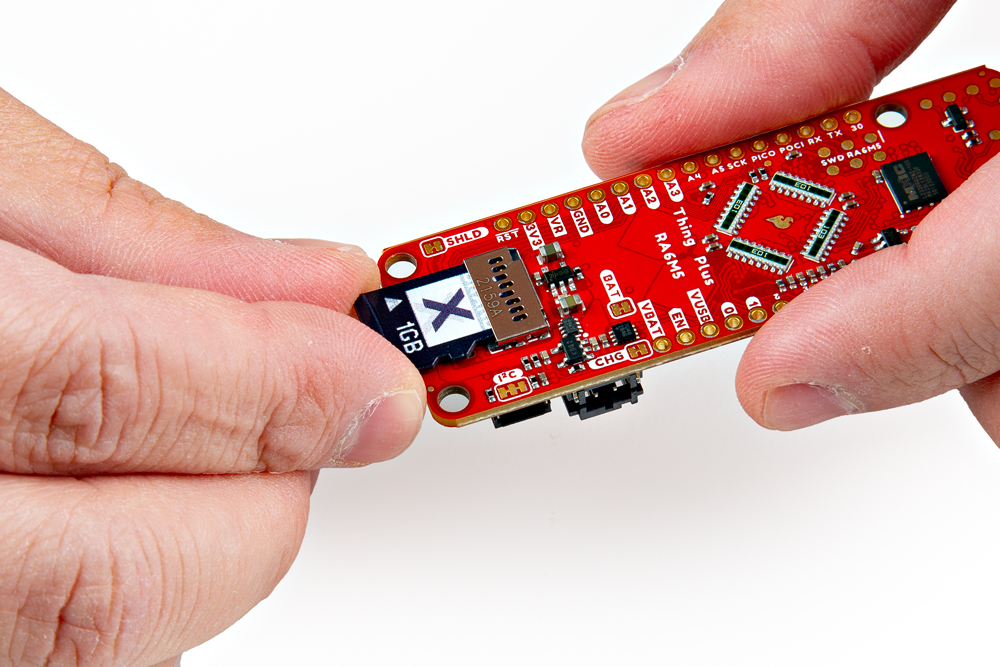
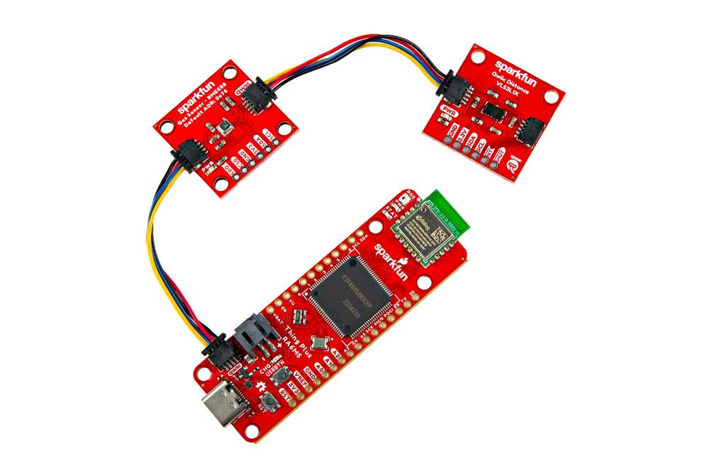

## USB-C Connector
The USB connection is utilized for programming and serial communication. Users only need to plug their RA6M5 Thing Plus into a computer using a USB-C cable.

<figure markdown>
[{ width="400" }](./assets/img/hookup_guide/assembly-usb.jpg "Click to enlarge")
<figcaption markdown>The RA6M5 Thing Plus with USB-C cable attached.</figcaption>
</figure>

## Battery
For remote IoT applications, a Li-Po battery can be connected. Additionally, users may be interested in utilizing a [solar panel](https://www.sparkfun.com/products/16835) and [USB-C cable](https://www.sparkfun.com/products/14743) to recharge their battery.

<figure markdown>
[{ width="400" }](./assets/img/hookup_guide/assembly-battery.jpg "Click to enlarge")
<figcaption markdown>The RA6M5 Thing Plus with a battery connected.</figcaption>
</figure>

-   <a href="https://www.sparkfun.com/products/16835">
	<figure markdown>
	
	</figure>		

	---

	**Solar Panel Charger - 10W** 
	TOL-16835</a>

-   <a href="https://www.sparkfun.com/products/14743">
	<figure markdown>
	
	</figure>		

	---

	**USB 3.1 Cable A to C - 3 Foot** 
	TOL-14743</a>

!!! warning
	Users should avoid pulling on the wires of a battery to disconnect it from the board. Instead, it is recommended that a pair of dikes (i.e. diagonal wire cutters), pliers, or tweezers be used to pull on the JST connector housing, to avoid damaging the battery wiring.

	<figure markdown>
	[{ width="400" }](./assets/img/hookup_guide/assembly-battery_removal.jpg "Click to enlarge")
	<figcaption markdown>Using a pair of dikes to disconnect a battery.</figcaption>
	</figure>

## Breakout Pins
The [PTH](https://en.wikipedia.org/wiki/Through-hole_technology "Plated Through Holes") pins on the RA6M5 Thing Plus are broken out into 0.1"-spaced pins on the edges of the board.

??? note "New to soldering?"
	If you have never soldered before or need a quick refresher, check out our [How to Solder: Through-Hole Soldering](https://learn.sparkfun.com/tutorials/how-to-solder-through-hole-soldering) guide.

	

	-   <a href="https://learn.sparkfun.com/tutorials/5">
		<figure markdown>
		
		</figure>

		---
		
		**How to Solder: Through-Hole Soldering**</a>

	

### Headers

Headers are versatile in their compatibility with shields, breadboards, or jumper wires.

<figure markdown>
[{ width="400" }](./assets/img/hookup_guide/assembly-headers.jpg "Click to enlarge")
<figcaption markdown>Soldering headers to the RA6M5 Thing Plus.</figcaption>
</figure>

### Hookup Wires

For a more permanent connection, users can solder wires directly to the board.

<figure markdown>
[{ width="400" }](./assets/img/hookup_guide/assembly-wires.jpg "Click to enlarge")
<figcaption markdown>Soldering wires to the RA6M5 Thing Plus.</figcaption>
</figure>

??? tip "Stackable Headers"
	Our [Feather Stackable Header Kit](https://www.sparkfun.com/products/15187) is a great option for stacking on shields *(w/ Feather footprint)* or on a breadboard; while leaving its pins still accessible.

	<figure markdown>
	[{ width="400" }](./assets/img/hookup_guide/assembly-stackable_headers.jpg "Click to enlarge")
	<figcaption markdown>Stackable headers on the RA6M5 Thing Plus.</figcaption>
	</figure>

## &micro;SD Card Slot
The RA6M5 Thing Plus includes a &micro;SD card slot on the back of the board. The cardholder functions through a push/pull operation. *(The card slot doesn't include a spring retention mechanism; cards are held in place through friction.)*

<figure markdown>
[{ width="400" }](./assets/img/hookup_guide/assembly-sd_card.jpg "Click to enlarge")
<figcaption markdown>Users can slide-in or pull-out a &micro;SD card from the cardholder.</figcaption>
</figure>

!!! info "SD Card Compatibility"
	The mosaic-X5 supports &micro;SD cards with a **FAT32** file system *(i.e. only cards **up to 32GB** in size)*.

### Qwiic Devices
The Qwiic system allows users to effortlessly prototype with a Qwiic compatible I^2^C device without soldering. Users can attach any Qwiic compatible [sensor or board](https://www.sparkfun.com/qwiic#sensors), with just a [Qwiic cable](https://www.sparkfun.com/products/15081). (*\*The example below, is for demonstration purposes and is not pertinent to the board functionality or this tutorial.*)

<figure markdown>
[{ width="400" }](./assets/img/hookup_guide/assembly-qwiic.jpg "Click to enlarge")
<figcaption markdown>The [BME688 environmental](https://www.sparkfun.com/products/19096) and [VL53L1X distance](https://www.sparkfun.com/products/14722) Qwiic sensor boards connected to the RA6M5 Thing Plus.</figcaption>
</figure>