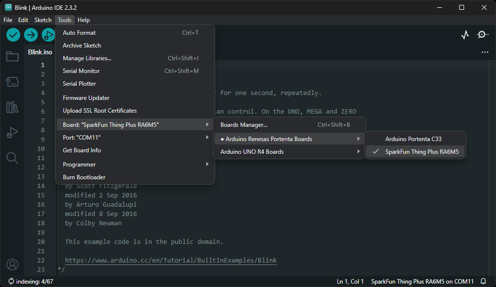

!!! tip
	For first-time users, who have never programmed before and are looking to use the Arduino IDE, we recommend beginning with the [SparkFun Inventor's Kit (SIK)](https://www.sparkfun.com/products/15631), which is designed to help users get started programming with the Arduino IDE.

Most users should already be familiar with the Arduino IDE and its use. However, for those of you who have never heard the name *Arduino* before, feel free to check out the [Arduino website](https://www.arduino.cc/en/Guide/HomePage). To get started with using the Arduino IDE, check out our tutorials below:


<div class="grid cards" markdown align="center">

-   <a href="https://learn.sparkfun.com/tutorials/50">
	<figure markdown>
	
	</figure>

	---

	**What is an Arduino?**</a>

-   <a href="https://learn.sparkfun.com/tutorials/61">
	<figure markdown>
	
	</figure>

	---

	**Installing the Arduino IDE**</a>

-   <a href="https://learn.sparkfun.com/tutorials/1265">
	<figure markdown>
	
	</figure>

	---

	**Installing Board Definitions in the Arduino IDE**</a>

-   <a href="https://learn.sparkfun.com/tutorials/15">
	<figure markdown>
	
	</figure>

	---

	**Installing an Arduino Library**</a>

</div>


## Arduino Core

### Installation
!!! success "Installing the *Ported* Renesas-Arduino Core"
	In order to program the RA6M5 Thing Plus in the Arduino IDE, users will need to install the **Arduino Renesas Portenta board** definitions from the Renesas-Arduino core. However, until the [RA6M5 Thing Plus is officially adopted into the Renesas-Arduino core](https://github.com/arduino/ArduinoCore-renesas/pull/290), users need to utilize [our port of the **Renesas-Arduino core**](./assets/SFE-Renesas-Arduino_core.zip).

	1. Before users can install our ported version of the Renesas-Arduino core, they should first install the **Arduino Renesas Portenta board** definitions of the [*official* Renesas-Arduino core](https://github.com/arduino/ArduinoCore-renesas) in the Arduino IDE.
		- This will ensure that any required compilation and upload tools are installed for the Arduino core.
		- In the Board Manager of the Arduino IDE, select and install the **Arduino Renesas Portenta board** definitions from the [Renesas-Arduino core](https://github.com/arduino/ArduinoCore-renesas).
			<figure markdown>
			[{ width="400" }](./assets/img/hookup_guide/arduino-renesas_core.png "Click to enlarge")
			<figcaption markdown>Installing the [Renesas-Arduino core](https://github.com/arduino/ArduinoCore-renesas) in the Arduino IDE.</figcaption>
			</figure>
	2. Once installed, users will need to locate the `packages` directory for the Arduino cores in the Arduino IDE:

		<div class="grid cards" markdown>

		-   **Windows**

			---

			On Windows, the directory location may vary based on whether the Arduino IDE was installed for an individual user or all users:

			- The user's `AppData` directory *(hidden folder - primary)*:

					C:\Users\{==<insert username>==}\AppData\Local\Arduino15\packages

			- The user's `ArduinoData` directory (*local*):

					C:\Users\{==<insert username>==}\Documents\Arduino\hardware

			- The `Program Files` or `Program Files(x86)` directories:

					C:\Program Files{++(x86)++}\Arduino IDE


		-   **MacOS**

			---

			With Mac OS, users should check the `Applications` and `Library` directories:

			- `Library` directory (primary):

					~/Library/Arduino15/packages/

			- `Applications` directory (*local*):

					/Applications/Arduino.app/hardware


		-   **Linux**

			---

			For Linux, this may be located in the following directories:

			- Primary:

					/home/$USER/.arduino15/packages

			- Local:

					/home/$USER/Arduino/hardware

			??? tip
				As mentioned in [Arduino's guide for installing the Arduino IDE on Linux](https://docs.arduino.cc/software/ide-v2/tutorials/getting-started/ide-v2-downloading-and-installing/#linux), users may need to run the following commands in the terminal:

				```bash
				sudo add-apt-repository universe
				sudo apt install libfuse2
				```

				In order to utilize the serial terminal or recognize the board in DFU mode, users may also need to run the following commands in the terminal:

				```bash
				usermod -a -G dialout $USERNAME
				usermod -a -G plugdev $USERNAME
				```

				- `$USERNAME` is the login username
				- After, a restart or logout is required

		</div>

	3. After the `packages` directory has been located, users will need to navigate to the Renesas Arduino core. It is usually located in the `./arduino/hardware/{==renesas_portenta==}/{++<version number>++}/` directory of the `packages` folder.
	4. The Arduino core is followed by a directory, named after the Arduino core's release `{++<version number>++}`. From there, users will need to create a new directory/folder in the `renesas_portenta` directory with the `version number` bumped up.
		- *For example, if the current version is `1.1.0`, users can name the new directory `1.2.0`.*
	4. Next, users will need to download and extract the files from [our ported version of the Renesas-Arduino core](./assets/SFE-Renesas-Arduino_core.zip):
		<center>
		[:material-download:{ .heart }&nbsp;&nbsp;Download our Renesas-Arduino Core *(Ported)*](./assets/SFE-Renesas-Arduino_core.zip "Click to download the ported Arduino core"){ .md-button .md-button--primary }
		</center>
	4. Once extracted, users will need to copy over the files from [our ported version of the Renesas-Arduino core](./assets/SFE-Renesas-Arduino_core.zip)into the new directory that was created earlier:
		<figure markdown>
		[{ width=500 }](./assets/img/hookup_guide/arduino-extracted_files.png "Click to enlarge")
		<figcaption markdown>The files extracted from [our ported version of the Renesas-Arduino core](./assets/SFE-Renesas-Arduino_core.zip).</figcaption>
		</figure>
	5. Once the extracted files have been copied into the new directory, users will need to install the USB drivers for the board by executing the `post-install.*` script:
		- Windows: `post-install.bat`
		- Mac/Linux: `post-install.sh`

	!!! info
		This information is accurate as of April 2024; however, it may become irrelevant in the future *(once the [RA6M5 Thing Plus is included in the Renesas-Arduino core](https://github.com/arduino/ArduinoCore-renesas/pull/290))*. At which point, users may disregard this note and/or request for this information to be updated by [filing an issue](../github/file_issue).


??? failure "Do Not Use - *Hardware Not Officially Supported (yet)*"
	!!! warning
		The instructions below are invalid; theRA6M5 Thing Plus has not been [officially added into the Renesas-Arduino core](https://github.com/arduino/ArduinoCore-renesas/pull/290). In the meantime, users will need to utilize [our port of the **Renesas-Arduino core**](./assets/SFE-Renesas-Arduino_core.zip) *(see instructions above)*.


	{--

	In order to program the RA6M5 Thing Plus in the Arduino IDE, users will need to install the [Renesas-Arduino core](https://github.com/arduino/ArduinoCore-renesas). The Arduino core can be found by searching for `Arduino Renesas Portenta Boards` in the **Board Manager** of the Arduino IDE. Once installed, the RA6M5 Thing Plus will become available in the **Board Manager**.

		Arduino Renesas Portenta Boards

	<div class="grid" markdown>

	<div markdown>

	For users who are unfamiliar with this process, please check out our tutorial on [installing an Arduino core](https://learn.sparkfun.com/tutorials/installing-board-definitions-in-the-arduino-ide/installing-an-arduino-board-definition).

	<div class="grid cards" markdown align="center">

	-   <a href="https://learn.sparkfun.com/tutorials/1265">
		<figure markdown>
		
		</figure>

		---

		**Installing Board Definitions in the Arduino IDE**</a>

	</div>

	</div>

	<div markdown>

	<figure markdown>
	[{ width="400" }](./assets/img/hookup_guide/arduino-renesas_core.png "Click to enlarge")
	<figcaption markdown>Installing the [Renesas-Arduino core](https://github.com/arduino/ArduinoCore-renesas) in the Arduino IDE.</figcaption>
	</figure>

	</div>

	</div>

	--}


### Programming a Board
In order to upload a sketch from the Arduino IDE onto the RA6M5 Thing Plus, users will need to select the `SparkFun Thing Plus RA6M5` from the **Tools** > **Board** > **Arduino Renesas Portenta Boards** > **SparkFun Thing Plus RA6M5** drop-down menu. Users will also need to select the serial port from the **Tools** > **Port** drop-down menu; the port should be automatically labeled, based upon the PID/VID of board in the USB driver.


<div class="grid" markdown>

<div markdown>

<figure markdown>
[{ width="400" }](./assets/img/hookup_guide/arduino-select_board.png "Click to enlarge")
<figcaption markdown>Selecting the `SparkFun Thing Plus RA6M5` from the **Tools** drop-down menu in the Arduino IDE.</figcaption>
</figure>

</div>


<div markdown>

<figure markdown>
[{ width="400" }](./assets/img/hookup_guide/arduino-select_board_alt.png "Click to enlarge")
<figcaption markdown>Searching for the `SparkFun Thing Plus RA6M5` in the **Select Other Board and Port** menu in the Arduino IDE.</figcaption>
</figure>

</div>

</div>


Alternatively, in the Arduino IDE *(v2.`x`.`x`)*, users can also search for the board and serial port in the **Select Other Board and Port** menu. Once the appropriate board and serial port have been selected in the Arduino IDE, users can click the ++"&rarr;"++ *(upload)* button to begin the compilation and upload process.


??? success "DFU Mode"
	If users are having issues uploading code to the board, the RA6M5 can be manually forced into DFU mode. This issue, often occurs when the USB connection is busy and a reset can't be triggered on the RA6M5, to initialize the upload process. To force the RA6M5 Thing Plus into DFU mode:

	1. Double-tap the ++"RST"++ button
		- The `STAT` LED should be fading in/out very slowly
	1. Users should now, be able to upload a new program
		- It shouldn't be necessary to select a COM port in the Arduino IDE; only the board needs to be selected
	1. Once programming is complete, the MCU should reboot on its own. Otherwise:
		- Press the ++"RST"++ button
		- Power cycle the board


## Arduino Libraries
In order to utilize some of the peripherals of the RA6M5 Thing Plus with the Arduino IDE, users will need to [install Arduino libraries](https://learn.sparkfun.com/tutorials/15) for the peripheral devices/interfaces. For users who are unfamiliar with this process, please check out our tutorial below:

<div class="grid cards" markdown align="center">

-   <a href="https://learn.sparkfun.com/tutorials/15">
	<figure markdown>
	
	</figure>

	---

	**Installing an Arduino Library**</a>

</div>


### MAX17048 Fuel Gauge
While users are free to choose any Arduino library that provides support for MAX17048 fuel gauge, we recommend the [SparkFun MAX1704x Arduino library](https://github.com/sparkfun/SparkFun_MAX1704x_Fuel_Gauge_Arduino_Library); as it has been tested and verified to work with the MAX17048 on the RA6M5 Thing Plus. The [SparkFun MAX1704x Fuel Gauge Arduino library](https://github.com/sparkfun/SparkFun_MAX1704x_Fuel_Gauge_Arduino_Library) can be installed from the **Library Manager** in the Arduino IDE by searching for:

	SparkFun MAX1704x Fuel Gauge Arduino Library


<div class="grid" markdown>

<div markdown>

<figure markdown>
[{ width="400" }](./assets/img/hookup_guide/arduino-MAX1704x_library.png)<figcaption markdown>SparkFun MAX1704x Fuel Gauge Arduino library in the library manager of the Arduino IDE.</figcaption>
</figure>

</div>

<div markdown>

!!! tip "Manually Download the Arduino Library"
	For users who would like to manually download and install the library, the `*.zip` file can be accessed from the [GitHub repository](https://github.com/sparkfun/MAX1704x_Fuel_Gauge_Arduino_Library) or downloaded by clicking the button below.

	<center>
	[:octicons-download-16:{ .heart } Download the Arduino Library](https://github.com/sparkfun/SparkFun_MAX1704x_Fuel_Gauge_Arduino_Library/archive/refs/heads/main.zip){ .md-button .md-button--primary }
	</center>

</div>

</div>


### WS2812 RGB LED
While users are free to choose any Arduino library that provides support for WS2812 LEDs, we recommend the [FastLED Arduino library](https://github.com/FastLED/FastLED/). It has been tested and verified to work with the RGB LED on the RA6M5 Thing Plus. The [FastLED Arduino library](https://github.com/FastLED/FastLED/) can be installed from the **Library Manager** in the Arduino IDE by searching for:

	FastLED Arduino Library


<div class="grid" markdown>

<div markdown>

<figure markdown>
[{ width="400" }](./assets/img/hookup_guide/arduino-FastLED_library.png)
<figcaption markdown>FastLED Arduino library in the library manager of the Arduino IDE.</figcaption>
</figure>

</div>

<div markdown>

!!! tip "Manually Download the Arduino Library"
	For users who would like to manually download and install the library, the `*.zip` file can be accessed from the [GitHub repository](https://github.com/FastLED/FastLED/) or downloaded by clicking the button below.

	<center>
	[:octicons-download-16:{ .heart } Download the Arduino Library](https://github.com/FastLED/FastLED/archive/refs/heads/master.zip){ .md-button .md-button--primary }
	</center>

</div>

</div>


??? tip "How to Define Parameters"
	While using the FastLED Arduino library, users need to define the following parameters to the **WS2812 RGB LED** included on the board. However, if additional LEDs are connected externally to the board, then the appropriate values should be provided for the Arduino library.

	**`#define NUM_LEDS 1`**
	:	There is only one WS2812 LED on the board

	**`#define DATA_PIN LED_RGB`**
	:	Declare which pin is connected to the WS2812 LED. On the RA6M5 Thing Plus, it is defined as `D13` or `RGB_LED` in the Arduino core for GPIO `P105`.

	**`#define LED_TYPE WS2812`**
	:	Declare the LED type for the library; the RA6M5 Thing Plus only includes `WS2812` RGB LED on the board.


### DA14531MOD BLE Module
--8<-- "./software-DA14531MOD.md"
